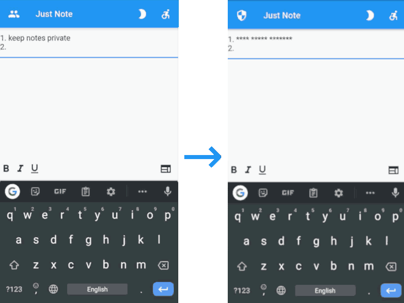

# Just Note

Simple mobile application to keep your notes with private text input. You can hide the text you enter from others around you.

# Preview

## Features
* Light and dark theme support
* Hide the content you write
* Easily create a numbered list

# Installation
## Build
1. Install [flutter](https://github.com/flutter/flutter/)
2. Clone repo `git clone https://github.com/diademoff/justnote.git`
3. `cd justnote/`
4. For Android: `flutter build apk`; for IOS: `flutter build ipa` (MacOS only)
5. Your apk: `build/app/outputs/flutter-apk/app-release.apk`

## Download
Download latest version from [releases](https://github.com/diademoff/justnote/releases) page